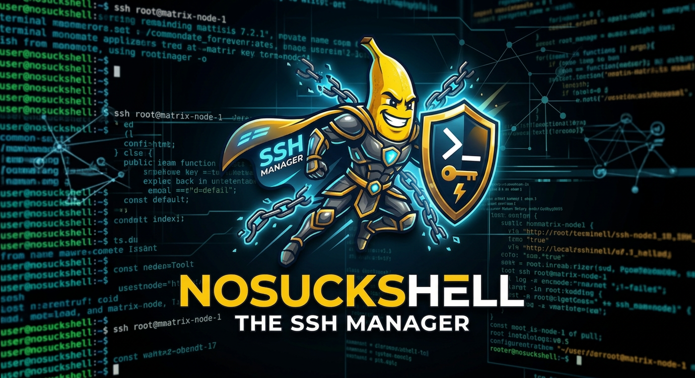

<p align="center">
  <a href="https://github.com/d0dg3r/NoSuckShell/releases"></a>
  <a href="https://github.com/d0dg3r/NoSuckShell/releases?q=prerelease%3Atrue"></a>
  <a href="https://github.com/d0dg3r/NoSuckShell/actions/workflows/ci.yml?query=branch%3Amain"></a>
  <a href="LICENSE"></a>
  
  <a href="https://github.com/sponsors/d0dg3r"></a>
</p>

# NoSuckShell

Cross-platform **SSH manager** desktop app (**Tauri** + **React**) focused on fast host management and clean terminal workflows.

**Repository:** [github.com/d0dg3r/NoSuckShell](https://github.com/d0dg3r/NoSuckShell)

## Highlights

- **Split workspace** — Start with one full-size panel; split recursively (e.g. left / bottom) with a default **60/40** ratio; resizable dividers; drag-and-drop panel reorder (swap).
- **Layout profiles** — Save, load, and delete layouts **with hosts** (geometry + host/session mapping) or **layout only** (geometry).
- **SSH integration** — Hosts from `~/.ssh/config`, embedded terminals (**xterm**), local shell sessions, quick connect.
- **Encrypted backups** — Export/import is password-protected; plain legacy JSON backups are rejected on purpose.
- **Cross-platform** — Linux, macOS, and Windows builds via [GitHub Releases](https://github.com/d0dg3r/NoSuckShell/releases).

## Install

### From GitHub Releases (recommended)

Download the latest **Release** or **Pre-release** asset for your platform from the [Releases](https://github.com/d0dg3r/NoSuckShell/releases) page.

### From source (developers)

**Requirements**

- **Node.js** and **npm** (for the desktop app under `apps/desktop`)
- **Rust** stable, **Cargo**, and [Tauri 2 prerequisites](https://v2.tauri.app/start/prerequisites/) for your OS

From the repository root, the first `npm run tauri:dev` / `desktop:build` can install dependencies under `apps/desktop` automatically if they are missing. You can still install explicitly:

```bash
npm run desktop:install
WEBKIT_DISABLE_DMABUF_RENDERER=1 npm run tauri:dev
```

On some Linux setups (e.g. certain WebKit builds), `WEBKIT_DISABLE_DMABUF_RENDERER=1` avoids blank or unstable webviews; omit if you do not need it.

Or from `apps/desktop`:

```bash
cd apps/desktop
npm install
npm run tauri:dev
```

## Validate locally

```bash
cd apps/desktop
npm test
npm run build
cd src-tauri
cargo test
cargo check
```

From the repo root you can run `npm run desktop:test` for the desktop package tests.

## Backup security

- Backup export/import is password protected and encrypted.
- Unencrypted legacy JSON backups are intentionally rejected.
- Backup path handling supports `~` expansion and cross-platform path normalization.

Details: [docs/backup-security.md](docs/backup-security.md)

## Release process (maintainers)

GitHub releases are created by pushing a SemVer tag:

- Final: `vMAJOR.MINOR.PATCH` (example: `v1.2.3`)
- Pre-release: `vMAJOR.MINOR.PATCH-<suffix>` (example: `v1.2.4-rc.1`, `v1.2.4-beta.1`)

```bash
git tag v0.1.0
git push origin v0.1.0
```

Full checklist: [docs/releases.md](docs/releases.md)

If the workflow rejects the tag, use `vMAJOR.MINOR.PATCH` or `vMAJOR.MINOR.PATCH-prerelease` (example: `v2.0.0` or `v2.0.0-rc.1`).

## Documentation

| Resource | Description |
| --- | --- |
| [docs/README.md](docs/README.md) | Documentation index |
| [docs/architecture.md](docs/architecture.md) | App architecture (Tauri, React, Rust, IPC) |
| [CONTRIBUTING.md](CONTRIBUTING.md) | Setup, validation, pull requests |
| [SECURITY.md](SECURITY.md) | Reporting vulnerabilities |
| [CODE_OF_CONDUCT.md](CODE_OF_CONDUCT.md) | Community standards |

## License

This project is released under the [MIT License](LICENSE).

## Support the project

If **NoSuckShell** is useful to you:

- **Star** the [repository](https://github.com/d0dg3r/NoSuckShell) so others can find it.
- **Sponsor** [d0dg3r on GitHub Sponsors](https://github.com/sponsors/d0dg3r) if you want to support maintenance.
- **Contribute** via [issues](https://github.com/d0dg3r/NoSuckShell/issues) and [pull requests](https://github.com/d0dg3r/NoSuckShell/pulls).
