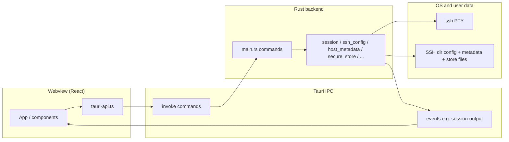
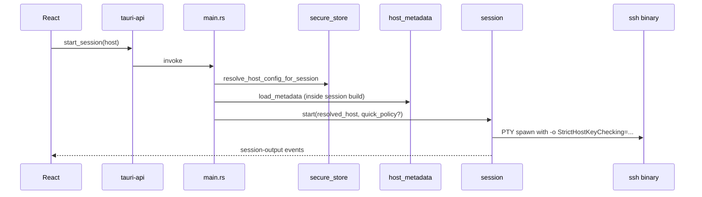

# Application architecture

Overview of the **NoSuckShell** desktop app: how the UI, Rust backend, and on-disk data fit together. For product history and early design notes, see [plans/2026-03-17-ssh-manager-design.md](plans/2026-03-17-ssh-manager-design.md). For backup cryptography, see [backup-security.md](backup-security.md).

## Stack

| Layer | Technology |
| --- | --- |
| Desktop shell | [Tauri 2](https://v2.tauri.app/) (Linux, macOS, Windows) |
| UI | React 19 + Vite + TypeScript (system webview) |
| Backend | Rust crate in `apps/desktop/src-tauri` |
| IPC | Tauri **commands** (`invoke`) and **events** (`emit` / `listen`) |
| Terminal | [xterm.js](https://xtermjs.org/) in [`TerminalPane.tsx`](../apps/desktop/src/components/TerminalPane.tsx) |
| SSH in terminal | System `ssh` in a PTY ([`session.rs`](../apps/desktop/src-tauri/src/session.rs)) |
| SFTP (file pane) | [ssh2](https://crates.io/crates/ssh2) over direct TCP ([`sftp.rs`](../apps/desktop/src-tauri/src/sftp.rs)) |

## High-level data flow

## Frontend layout

| Area | Location | Notes |
| --- | --- | --- |
| Root state and wiring | [`App.tsx`](../apps/desktop/src/App.tsx) | Hosts, sessions, workspaces, settings modal, metadata store sync |
| Reusable UI | [`components/`](../apps/desktop/src/components/) | Sidebar, panes, modals, settings tabs |
| Domain logic | [`features/`](../apps/desktop/src/features/) | DnD, split layout, host form helpers, view filters, backup-related types |
| IPC facade | [`tauri-api.ts`](../apps/desktop/src/tauri-api.ts) | All `invoke` calls in one place |
| Shared wire types | [`types.ts`](../apps/desktop/src/types.ts) | DTOs aligned with Serde on the Rust side |
| In-app help | [`HelpPanel.tsx`](../apps/desktop/src/components/HelpPanel.tsx) | Chaptered help (Settings → Help) |

Refactoring notes for `App.tsx`: [refactoring-app-roadmap.md](refactoring-app-roadmap.md).

## Backend modules (Rust)

Command registration: [`main.rs`](../apps/desktop/src-tauri/src/main.rs) (`tauri::generate_handler![...]`).

| Module | Responsibility |
| --- | --- |
| `session` | Allocate PTY, spawn `ssh` or local shell, pipe stdout/stderr to `session-output` events; `send_input`, resize, kill |
| `ssh_config` | Parse/render `Host` blocks in the effective SSH config file |
| `ssh_home` | Resolve SSH directory (default, override from settings) |
| `host_metadata` | `nosuckshell.metadata.json`: favorites, tags, `lastUsedAt`, `trustHostDefault`, optional `strictHostKeyPolicy` |
| `secure_store` | Encrypted entity store JSON + `resolve_host_config_for_session` (merge config host + `HostBinding` + linked `UserObject`) |
| `store_models` | Serde models for users, keys, groups, tags, bindings |
| `quick_ssh` | Normalize quick-connect payload into `HostConfig` + optional strict-host-key override |
| `backup` / `key_crypto` | Encrypted backup envelope |
| `layout_profiles` / `view_profiles` | Persisted JSON for layouts and host-list view profiles |
| `sftp` | Remote/local file ops over libssh2 (no ProxyJump/ProxyCommand in this path today) |

## SSH session path (terminal)

1. UI calls `start_session` with a `HostConfig` (alias, HostName, user, port, identity file, `proxyJump`, `proxyCommand`).
2. `resolve_host_config_for_session` applies the entity store binding and linked user (user string, HostName, keys, proxy fields, etc.).
3. `build_ssh_command` adds OpenSSH flags, including **`StrictHostKeyChecking`** from `host_metadata` for the host alias (or from the quick-connect request for ephemeral sessions).
4. Child `ssh` runs under a PTY; output is chunked into `SessionOutputEvent` (includes a flag when the known-hosts prompt substring appears).

## SFTP path (file browser)

- Resolves host the same way for **saved** hosts (`resolve_host_config_for_session`).
- Opens **TCP** to `HostName:port` and starts libssh2—**not** the same as `ssh -J` / `ProxyCommand`.
- Documented limitation: use direct-reachable hosts or rely on terminal + SSH for bastioned paths.

## Identity Store (conceptual)

- **Users** — display name, SSH username, optional per-user HostName / ProxyJump, key references.
- **Keys** — path-based or encrypted key material in the store.
- **Host bindings** — per config-host alias: linked user, key refs, groups/tags, `proxyJump`, `legacyProxyCommand`, etc.
- At session time, binding and user rows override or fill fields on top of the parsed SSH config host.

## IPC surface (categories)

- **Hosts:** list/save/delete hosts, raw config read/write, SSH dir info and override
- **Metadata:** list/save metadata, touch `lastUsedAt`
- **Sessions:** start SSH, start local shell, start quick SSH, send input, resize, close
- **Store:** CRUD-ish commands for encrypted store entities and key unlock
- **Backup / profiles:** export/import backup, layout and view profile persistence
- **SFTP:** list/download/upload/rename/… for remote and local panes

Authoritative list: `generate_handler![...]` in `main.rs` and matching names in `tauri-api.ts`.

## Events

- Primary: **`session-output`** — terminal stream + `host_key_prompt` hint for trust UI.
- Frontend listeners: [`TerminalPane.tsx`](../apps/desktop/src/components/TerminalPane.tsx), [`useSessionOutputTrustListener.ts`](../apps/desktop/src/hooks/useSessionOutputTrustListener.ts), and related refs in `App.tsx`.

## On-disk artifacts (typical)

| Artifact | Role |
| --- | --- |
| Effective `config` under SSH dir | Managed `Host` blocks |
| `nosuckshell.metadata.json` | Per-alias UI metadata and host-key policy |
| Entity store file (under app data) | Identity Store (encrypted) |
| Layout / view profile JSON | Workspace and sidebar view state |

Exact paths depend on platform and optional SSH dir override (see Settings → SSH and `ssh_home`).

## Related documentation

| Doc | Content |
| --- | --- |
| [backup-security.md](backup-security.md) | Backup format and threat model |
| [releases.md](releases.md) | Tags and GitHub releases |
| [CHANGELOG.md](CHANGELOG.md) | Release notes |
| [README.md](README.md) (repo root) | Clone, build, run |
