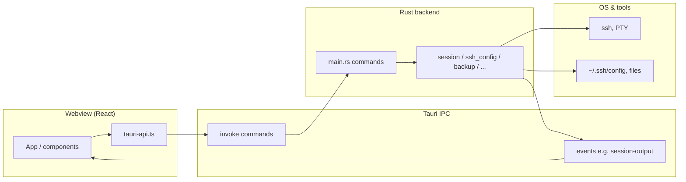

# Application architecture

Concise overview of the **NoSuckShell** desktop app. For deeper product history and MVP notes, see [plans/2026-03-17-ssh-manager-design.md](plans/2026-03-17-ssh-manager-design.md).

## Overview

- **Shell:** [Tauri 2](https://v2.tauri.app/) desktop app (Linux, macOS, Windows).
- **Frontend:** React + Vite (TypeScript), rendered in the system webview.
- **Backend:** Rust (`apps/desktop/src-tauri`), exposed to the UI via Tauri **commands** and **events**.

## High-level data flow

## Frontend

| Area | Location |
| --- | --- |
| Main UI entry | [`apps/desktop/src/App.tsx`](../apps/desktop/src/App.tsx) |
| Reusable UI | [`apps/desktop/src/components/`](../apps/desktop/src/components/) |
| Domain-oriented helpers | [`apps/desktop/src/features/`](../apps/desktop/src/features/) |
| `invoke` wrappers | [`apps/desktop/src/tauri-api.ts`](../apps/desktop/src/tauri-api.ts) |
| Shared DTOs / types | [`apps/desktop/src/types.ts`](../apps/desktop/src/types.ts) |
| Terminal (xterm) | [`apps/desktop/src/components/TerminalPane.tsx`](../apps/desktop/src/components/TerminalPane.tsx) |

The UI calls Rust through `invoke` from `@tauri-apps/api/core` (centralized in `tauri-api.ts`).

## Backend (Rust)

Command registration lives in [`apps/desktop/src-tauri/src/main.rs`](../apps/desktop/src-tauri/src/main.rs) (`invoke_handler` / `generate_handler![...]`).

| Module | Role |
| --- | --- |
| `session` | PTY sessions for SSH / local shells; streams I/O to the UI. |
| `ssh_config` | Read/write `~/.ssh/config` host entries. |
| `host_metadata` | App-specific metadata (e.g. last used) alongside SSH config. |
| `backup` / `key_crypto` | Encrypted backup envelope (see [backup-security.md](backup-security.md)). |
| `layout_profiles` / `view_profiles` | Saved workspace layouts and view profiles. |
| `secure_store` / `store_models` | Entity store: host bindings, keys, users, groups, tags (via commands). |

## IPC surface

Commands are grouped roughly as: **hosts & metadata**, **sessions** (start, input, resize, close), **secure store** (entities, keys), **backup** (export/import), **layout & view profiles**.

For the authoritative list, see `generate_handler![...]` in `main.rs` and the corresponding `invoke(...)` calls in `tauri-api.ts`.

## Events

The backend emits terminal output (and related session signals) as Tauri events. The frontend subscribes with `listen` from `@tauri-apps/api/event`, for example the `session-output` listener in [`TerminalPane.tsx`](../apps/desktop/src/components/TerminalPane.tsx) (and related wiring in [`App.tsx`](../apps/desktop/src/App.tsx)).

## Related documentation

- Backup cryptography and threat model: [backup-security.md](backup-security.md)
- Releases: [releases.md](releases.md)
